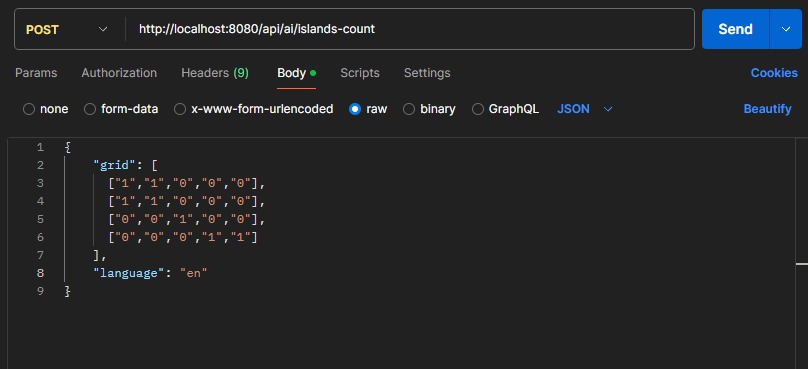

# 🌍 Island Counter with Quarkus + Gemini (LangChain4j) + BFS + AI Explanation

This project is a **Quarkus-based REST API** that processes a 2D map grid (with `1`s as land and `0`s as water), calculates the number of **islands** using the **Breadth-First Search (BFS)** algorithm, and responds with a **human-friendly explanation generated by a Language Model (LLM)** such as **Gemini**, powered by **LangChain4j**.

It demonstrates how to combine classic algorithms with modern GenAI in a clean, explainable, and production-ready way using Java and Quarkus.

---

## ✨ What It Does

- Accepts a grid of `1`s and `0`s via a `POST /api/islandscount` endpoint
- Allows specifying a **language code** (e.g., `"en"`, `"pt"`, `"es"`) in the request body
- If no language is provided, it defaults to `"en"` (English)
- Uses a **BFS algorithm** to count the number of distinct islands
- Sends the result to an LLM (via LangChain4j) to generate a **natural language explanation**
- Streams back a friendly explanation for the user
- Supports both **Gemini (Google AI)** and optionally OpenAI

---

## 🛠️ Technologies Used

- ☕ Java 24
- ⚡️ Quarkus 3.21.x
- 🤖 LangChain4j
- 🧠 Gemini (via `quarkus-langchain4j-ai-gemini`)
- 🧪 RESTEasy Reactive
- ⚙️ Maven

---

## 🚀 How to Run

### 1. 🧱 Clone the project

```bash
git clone https://github.com/pedrocarrijo95/quarkus-gemini-bfs.git
cd quarkus-gemini-bfs
```

### 2. ⚙️ Configure the application

Edit src/main/resources/application.properties:

```yaml
quarkus.http.port=8080
quarkus.langchain4j.ai.gemini.m1.api-key=<your_gemini_api_key>
quarkus.langchain4j.ai.gemini.m1.chat-model.model-id=gemini-1.5-pro
```

### 3. ▶️ Run the application

```bash
  mvn clean install -DskipTests
  cd target/quarkus-app/
  java -jar target/quarkus-run.jar
```




The server will be available at:

```bash
http://localhost:8080 or 8081
```

```bash
curl -X POST http://localhost:8080/api/islands-count \
  -H "Content-Type: application/json" \
  -d '{
    "grid": [
      ["1","1","0","0","0"],
      ["1","1","0","0","0"],
      ["0","0","1","0","0"],
      ["0","0","0","1","1"]
    ],
    "language": "en"
  }'
```

### 5. ▶️ Response Example
```bash
"Three islands were found on the map, calculated using the BFS algorithm. Each one represents a separate piece of land surrounded by water."
```


## ✅ Why This Matters
### This project is an example of:

Real-world Java + AI integration

How to build smart, explainable microservices

Applying classic algorithms (BFS) + LLMs for user-friendly output

Using open source and GenAI to solve problems in production-ready apps

## 🧠 Extra Ideas
🔀 Switch from BFS to DFS with a config flag

📈 Add metrics to track performance

🌐 Translate response based on lang input

🧩 Add front-end to visualize the grid and AI response


## Why Learning BFS Is Powerful in Real-World Systems

🔐 Cybersecurity
Track how malware or unauthorized access might propagate through a network

Identify breach paths and segment vulnerabilities in real time

🚗 Routing and Logistics
Find the shortest path in non-weighted graphs (e.g. package routing, delivery optimization)

Used in Waze, Google Maps, and logistics platforms

🌐 Social Networks and Graph Analysis
Determine if users are connected (even indirectly) via friends-of-friends logic

Power recommendation engines and community detection

🧠 Artificial Intelligence (AI)
Explore state spaces in games, planning systems, and simulations

Used in AI agents to find the most efficient decision path

🌍 Geospatial Systems
Detect and isolate zones of interest (e.g. islands, fire zones, flooded regions) in satellite images or maps

Helps in disaster response and urban planning
